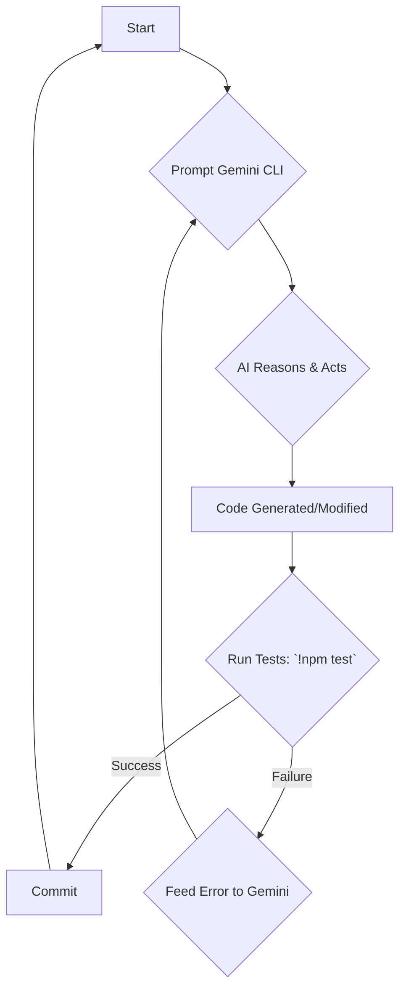
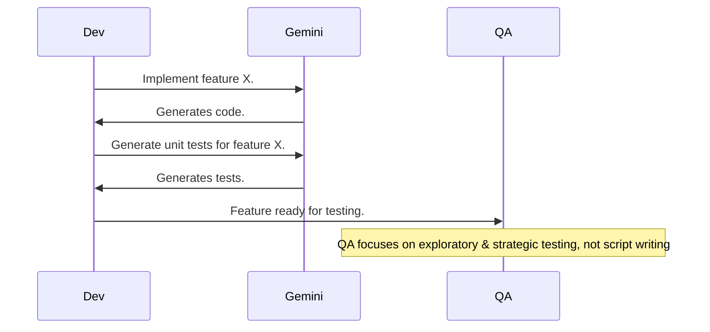
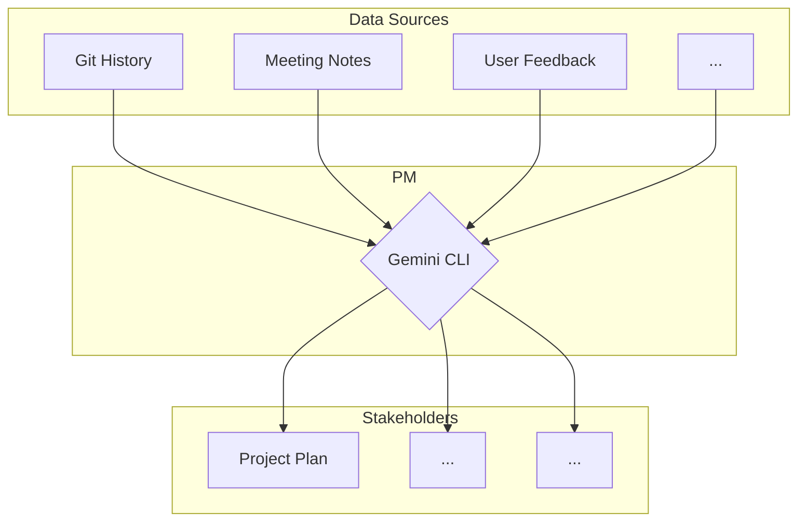

## The Problem: The Friction of Modern Work

- Tool Sprawl: IDE, Terminal, Git Client, Jira, Confluence, Slack, Figma...

<!-- .element: class="fragment" -->

- Context Switching: Each tool change is a mental reset, breaking your flow.

<!-- .element: class="fragment" -->

- Cognitive Load: Translating intent ("Deploy the staging server") into specific commands and clicks is mentally taxing.

<!-- .element: class="fragment" -->

- The Result: Slower cycles, developer burnout, and innovation bottlenecks.

<!-- .element: class="fragment" -->

;HS;

## The Next Paradigm Shift: The Conversational UI

We've evolved from...

;VS;

1.  Command-Line Interface (CLI): Power for experts.

<!-- .element: class="fragment" -->

2.  Graphical User Interface (GUI): Accessibility for everyone.

<!-- .element: class="fragment" -->

3.  Conversational User Interface (CUI): The next step. Power + Accessibility.

<!-- .element: class="fragment" -->

;VS;

Instead of telling the computer how to do something, you simply tell it what you want to achieve.

<!-- .element: class="fragment" -->

;HS;

## Introducing Gemini CLI

An open-source, intelligent Al agent that lives in your terminal.

;VS;

- It's Conversational: Understands natural language commands.

<!-- .element: class="fragment" -->

- It's an Agent: It can Reason, Act, and Observe using a suite of tools to accomplish complex tasks.

<!-- .element: class="fragment" -->

;VS;

- It's Context-Aware: A massive 1M token context window allows it to understand your entire codebase, not just a single file.

<!-- .element: class="fragment" -->

- It's Secure: Runs locally on your machine. Your code never leaves your device.

<!-- .element: class="fragment" -->

;HS;

## Agenda: A Tool for the Whole Team

1.  For Developers: The Al Copilot
<!-- .element: class="fragment" -->


1.  For QAs: The Quality Multiplier
<!-- .element: class="fragment" -->


3.  For Project Managers: The Command Center
<!-- .element: class="fragment" -->


1.  For Everyone: Mastery & The Future
<!-- .element: class="fragment" -->


;HS;

## Part 1: The Developer's Copilot

Transforming the terminal from a command executor to a collaborative partner.

;VS;

### Dev Workflow 1: Instant Codebase Comprehension

**Problem:** Onboarding to a new or legacy project is slow and painful.

<!-- .element: class="fragment" -->

**Solution:** Use Gemini CLI as an on-demand project guide.

<!-- .element: class="fragment" -->

;VS;

**Example Prompts:**

<!-- .element: class="fragment" -->

-   **High-Level Overview:**

    <!-- .element: class="fragment" -->
    > I've just cloned this repo. Give me a high-level overview of the project structure.
    <!-- .element: class="fragment" -->

;VS;

-   **Trace a Core Flow:**

    <!-- .element: class="fragment" -->
    > Explain the data flow for user authentication in this application, from the frontend to the database.
    <!-- .element: class="fragment" -->

;VS;

-   **Visualize Architecture:**

    <!-- .element: class="fragment" -->
    > Analyze the code and generate a MermaidJS flowchart that visualizes the component interactions.
    <!-- .element: class="fragment" -->

;VS;

### Dev Workflow 2: Accelerated Development & Refactoring

**Problem:** Writing boilerplate, modernizing old code, and adding documentation is repetitive.

<!-- .element: class="fragment" -->

**Solution:** Delegate code generation and refactoring to the agent.

<!-- .element: class="fragment" -->

;VS;

**Example Prompts:**

<!-- .element: class="fragment" -->

-   **Generate a New React Component:**

    <!-- .element: class="fragment" -->
    > Create a new React component named 'UserProfileCard' in a new file. It should take 'user' as a prop.
    <!-- .element: class="fragment" -->

;VS;

-   **Modernize Legacy Code:**

    <!-- .element: class="fragment" -->
    > Refactor this function to use modern async/await syntax instead of nested .then() calls.
    <!-- .element: class="fragment" -->

;VS;

### Dev Workflow 3: DevOps in Plain English

**Problem:** Complex syntax for tools like Docker and Kubernetes creates a bottleneck.

<!-- .element: class="fragment" -->

**Solution:** Use the Model Context Protocol (MCP) to create a natural language layer over your infrastructure.

<!-- .element: class="fragment" -->

;VS;

**Example Prompts (with Docker & K8s MCPs):**

<!-- .element: class="fragment" -->

-   **Docker:**

    <!-- .element: class="fragment" -->
    > Create an optimized, multi-stage Dockerfile for this Node.js application. Use a slim base image.
    <!-- .element: class="fragment" -->

;VS;

-   **Kubernetes:**

    <!-- .element: class="fragment" -->
    > Scale the 'payment-service' deployment to 3 replicas in the 'production' namespace.
    <!-- .element: class="fragment" -->

;VS;

### Dev Workflow 4: Advanced Git Assistance

**Problem:** Writing conventional commit messages and navigating complex git history is tedious.

<!-- .element: class="fragment" -->

**Solution:** Use Gemini CLI to automate git-related documentation and get operational guidance.

<!-- .element: class="fragment" -->

;VS;

**Example Prompts:**

<!-- .element: class="fragment" -->

-   **Generate a Commit Message:**

    <!-- .element: class="fragment" -->
    !git diff --staged
    <!-- .element: class="fragment" -->
    
    > Based on the staged changes, write a commit message that follows the Conventional Commits specification. The change is a new feature.
    <!-- .element: class="fragment" -->

;VS;

-   **Explain a Git Concept:**

    <!-- .element: class="fragment" -->
    > My team lead told me to rebase my feature branch before merging. Explain what that means and why it's useful.
    <!-- .element: class="fragment" -->

;VS;

### The Developer's AI-Powered Inner Loop



;HS;

## Part 2: The QA Multiplier

Shifting focus from manual script authoring to high-level test strategy and risk analysis.

;VS;

### QA Workflow 1: Generate Test Cases from Requirements

**Problem:** Manually translating user stories into test cases is time-consuming and prone to missing edge cases.

<!-- .element: class="fragment" -->

**Solution:** Generate structured test cases directly from requirements documents.

<!-- .element: class="fragment" -->

;VS;

**Example Prompt:**

<!-- .element: class="fragment" -->

-   **Generate BDD-Style Tests:**

    <!-- .element: class="fragment" -->
    > Here is a user story: "As a logged-in user, I want to add an item to my cart so that I can purchase it later." Generate BDD-style tests for this.
    <!-- .element: class="fragment" -->

;VS;

### QA Workflow 2: Automated UI Test Scripting

**Problem:** Writing and maintaining brittle UI automation scripts is a major bottleneck.

<!-- .element: class="fragment" -->

**Solution:** Generate and "self-heal" UI test scripts using natural language.

<!-- .element: class="fragment" -->

;VS;

**Example Prompts:**

<!-- .element: class="fragment" -->

-   **Generate a New Selenium Script:**

    <!-- .element: class="fragment" -->
    > Write a Selenium test in Python that navigates to the login page, enters credentials, and verifies successful login.
    <!-- .element: class="fragment" -->

;VS;

-   **"Self-Heal" a Broken Test:**

    <!-- .element: class="fragment" -->
    > This Playwright test is failing because a button's ID changed. Update the script to use the new ID.
    <!-- .element: class="fragment" -->

;VS;

### QA Workflow 3: API & Data Validation

**Problem:** Manually creating varied and realistic mock data is tedious.

<!-- .element: class="fragment" -->

**Solution:** Generate structured mock data on the fly.

<!-- .element: class="fragment" -->

;VS;

**Example Prompts:**

<!-- .element: class="fragment" -->

-   **Generate Mock JSON Data:**

    <!-- .element: class="fragment" -->
    > Generate a JSON array of 15 mock product objects. Each must have: 'id' (UUID), 'name' (string), and 'price' (number).
    <!-- .element: class="fragment" -->

;VS;

-   **Ensure Schema Conformance:**

    <!-- .element: class="fragment" -->
    > I need JSON data that strictly conforms to this Pydantic model. Craft a prompt to generate it.
    <!-- .element: class="fragment" -->

;VS;

### Shortening the QA Feedback Loop



;HS;

## Part 3: The Project Manager's Command Center

Moving from "status asker" to "data synthesizer" for proactive, informed decision-making.

;VS;

### PM Workflow 1: Automated Reporting & Summarization

**Problem:** Gathering status updates from Git, Jira, and email to compile reports is a manual time sink.

<!-- .element: class="fragment" -->

**Solution:** Use Gemini CLI as an automated reporting assistant.

<!-- .element: class="fragment" -->

;VS;

**Example Prompts:**

<!-- .element: class="fragment" -->

-   **Get a Dev-Centric Update:**

    <!-- .element: class="fragment" -->
    > Analyze the git commit log for the 'main' branch over the past 7 days and generate a summary of new features and bug fixes.
    <!-- .element: class="fragment" -->

;VS;

-   **Create an Executive Summary:**

    <!-- .element: class="fragment" -->
    > Read the attached project charter, meeting notes, and risk register. Generate a one-page executive summary.
    <!-- .element: class="fragment" -->

;VS;

### PM Workflow 2: Agile & Task Management

**Problem:** Breaking down large epics into user stories and creating tickets is repetitive.

<!-- .element: class="fragment" -->

**Solution:** Use Gemini CLI to structure work and interact with PM tools via MCPs.

<!-- .element: class="fragment" -->

;VS;

**Example Prompts:**

<!-- .element: class="fragment" -->

-   **Break Down an Epic:**

    <!-- .element: class="fragment" -->
    > Take this epic: "As an admin, I want a new dashboard to view sales analytics." Break it down into smaller user stories.
    <!-- .element: class="fragment" -->

;VS;

-   **Generate a Project Plan:**

    <!-- .element: class="fragment" -->
    > Generate a project plan in a markdown table for our new mobile app launch. Include phases, key tasks, and estimated durations.
    <!-- .element: class="fragment" -->

;VS;

### PM Workflow 3: Strategic Planning & Risk Assessment

**Problem:** The "blank page problem" for charters and risk assessments can lead to missed risks.

<!-- .element: class="fragment" -->

**Solution:** Use Gemini CLI as a brainstorming partner to suggest structures and identify potential risks.

<!-- .element: class="fragment" -->

;VS;

**Example Prompts:**

<!-- .element: class="fragment" -->

-   **Proactive Risk Identification:**

    <!-- .element: class="fragment" -->
    > Our team is planning to migrate our on-premise database to the cloud. Brainstorm potential risks.
    <!-- .element: class="fragment" -->

;VS;

-   **Draft Foundational Documents:**

    <!-- .element: class="fragment" -->
    > Generate a first draft of a Project Charter for a new initiative to "Develop a Customer Loyalty Program."
    <!-- .element: class="fragment" -->

;VS;

### The PM's Information Hub



;HS;

## Part 4: For Everyone: Mastery & The Future

;VS;

### Mastering Context with `GEMINI.md`

The single most important feature for customization. A special file in your project root that acts as a persistent "system prompt".

<!-- .element: class="fragment" -->

;VS;

**`GEMINI.md` Example:**

<!-- .element: class="fragment" -->

**Project: Phoenix Web App - Core Instructions**

<!-- .element: class="fragment" -->

1.  **Core Technologies**

    <!-- .element: class="fragment" -->
    -   Frontend: React with TypeScript, functional components, and hooks.
    -   Backend: Node.js with Fastify and Prisma ORM.
    -   Testing: Vitest and Playwright.

;VS;

2.  **Coding Standards**

    <!-- .element: class="fragment" -->
    -   All git commit messages MUST follow the Conventional Commits spec.
    -   All new API endpoints must have OpenAPI JSDoc comments.

;VS;

3.  **Agent Persona & Directives**

    <!-- .element: class="fragment" -->
    -   You are a senior full-stack engineer.
    -   DO NOT suggest using class-based components in React.

;VS;

### The Future: The AI-Native SDLC

We are moving from a linear, siloed process to an intelligent, adaptive system where Al is the connective tissue.

<!-- .element: class="fragment" -->

;VS;

-   **Traditional SDLC:**

    <!-- .element: class="fragment" -->
    Requirements → Design → Develop → Test → Deploy

;VS;

-   **AI-Native SDLC:**

    <!-- .element: class="fragment" -->
    A continuous, collaborative loop where an AI agent can:
    -   Generate tests from requirements.

        <!-- .element: class="fragment" -->
    -   Generate deployment scripts from code analysis.

        <!-- .element: class="fragment" -->
    -   Refactor code based on real-time security scans.

        <!-- .element: class="fragment" -->

;VS;

This collapses cycle times and blurs the lines between Dev, QA, and Ops.

<!-- .element: class="fragment" -->

;HS;

## Key Takeaways

-   **For Developers:** An AI copilot for coding, debugging, and DevOps.

<!-- .element: class="fragment" -->

-   **For QAs:** A force multiplier for test generation, automation, and analysis.

<!-- .element: class="fragment" -->

-   **For PMs:** A command center for reporting, planning, and risk assessment.

<!-- .element: class="fragment" -->

;VS;

The conversational terminal is here. It reduces friction and allows your team to focus on what matters: building great products.

<!-- .element: class="fragment" -->

;HS;

## Get Started in 60 Seconds

1.  **Prerequisite:** Node.js v18+

<!-- .element: class="fragment" -->

2.  **Install & Run:**

<!-- .element: class="fragment" -->
    ```bash
    npx https://github.com/google-gemini/gemini-cli
    ```
3.  **Authenticate with your Google account.** (Provides a generous free tier)

<!-- .element: class="fragment" -->

;HS;

## Thank You & Q&A

- Questions?
- Find these slides at: [Link]
- Contact: