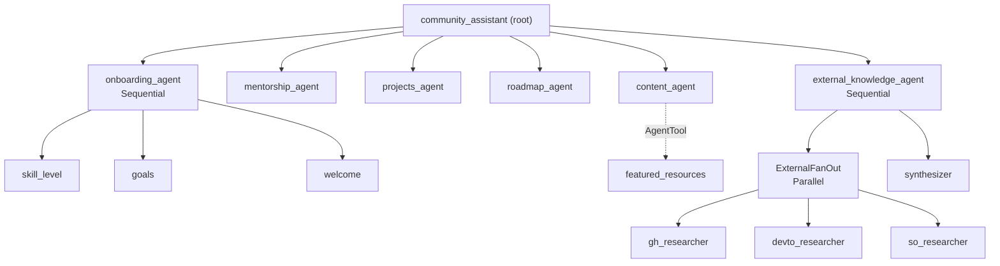

<!--
title: An Orchestra of Agents: What I Learned Running a Multi-Agent System for 5,000+ Developers
date: 2026-09-08
venue: Full-length 60-min master (stage cut: orchestra-of-agents-agntcon)
tags: AI, Agentic, ADK, Production
description: The production multi-agent system behind the code-with-ahsan Discord - orchestration patterns, the callback layer nobody writes about, deployment gotchas, and the war stories with receipts.
-->

# An Orchestra of Agents

### What I learned running a multi-agent system for 5,000+ developers

<small>Muhammad Ahsan Ayaz · GDE in AI & Angular</small><br/>
<small>AGNTCon + MCPCon Europe · 2026</small>

Note:
Hi, I'm Ahsan. For the past year I've been running a multi-agent system in production for my developer community, and tonight I'm going to show you everything: the architecture, the numbers, and the bugs I shipped to five thousand people.

By the end of this hour you'll know which agent patterns survive contact with real users, and which ones I had to hotfix at eight in the evening.

*Under 30 seconds. Don't read the slide. Hit the promise and move.*

---

## Scan for Slides & Code 📱


<!-- .element style="height: 400px" -->

- All links related to this session
- The postmortems I'll be quoting
- My socials

Note:
If you want to follow along or dig into the postmortems later, scan this now. Everything I show today, including the incident reports, is in there.

*TODO Ahsan: generate qr-code.png for this deck's link hub.*

---

```text
[2026-05-23 19:55] user report:

  Q: "any good repos for Google's Antigravity CLI?"
  A: "dev.to temporarily unavailable."
```

5,000 developers. 16 agents. One `break` statement.

<!-- .element: class="fragment" -->

Note:
Before anything else, I want to show you a real log line.

*Pause two seconds after the log appears. Say nothing.*

A member of my community asked the bot a normal question. The bot answered with an internal error message from a website the user never mentioned.

Five thousand developers. Sixteen agents. And the whole thing came down to one break statement.

--

## We'll come back to this.

Note:
Hold that thought. We'll come back to this exact log at the end, and by then you'll be able to spot the bug yourself.

*Move on briskly. Nothing sells an hour of architecture like an unresolved crime scene.*

---

## Who here runs an AI agent in production? 🙋

--

### Who here runs more than one... talking to each other? 🙋

--

### And who found their worst agent bug from a user's message instead of their telemetry? 🙋

--

 <!-- .element: style="width: 50%;" -->

prompt:
Generate a super realistic image of a programmer using this drawing. Keep the weird pose as much as realistically possible.
Use myself as the programmer in the image.

<!-- .element: class="fragment" -->

--


--

 <!-- .element: style="width: 30%;" -->

#### +

[Prompt]

#### +

##  <!-- .element: style="width: 30%;" -->

--


--


<!-- .element style="height: 500px" -->

--


<!-- .element style="height: 500px" -->

<audio data-autoplay src="assets/audio/fahhh.mp3"></audio>

Note:
*The hands question is the segue: "keep your hand up... this talk is for you."*

And this is what I try to use AI for. My kids draw me in impossible poses, and I make Gemini take them seriously.

*Click through the cascade. Don't over-explain, the images do the work.*

---

## Whoami

<div style="display:flex;gap:2rem;align-items:center">
<div style="flex:2">

**Muhammad Ahsan Ayaz**

- GDE in AI & Angular
- Software Architect
- 4x Author, 14M+ OSS installs
- Runs codewithahsan.dev (5,000+ devs)

</div>
<div style="flex:1;text-align:center;opacity:0.5">
<small>Also me: shipped a `break`<br/>statement to 5,000 people 😅</small>
</div>
</div>

Note:
I'm Ahsan. GDE in AI and Angular, software architect, and I run the code-with-ahsan community.

The right column is the honest version of this slide.

*Five seconds. Don't read the slide.*

---

## The problem with being the community

> _"How do I start with Angular? Any recent articles worth reading? Also... is anyone here open to mentoring me?"_

One Discord message. Three different specialists.

<!-- .element: class="fragment" -->

And one of me.

<!-- .element: class="fragment" -->

What could go wrong?

<!-- .element: class="fragment" -->

Note:
Here's the actual shape of a message in my Discord. One sentence, three completely different jobs: a learning roadmap, fresh content search, and mentor matching.

The community is about 4,600 developers and climbing toward the number on the title slide. There is exactly one of me, and I sleep sometimes.

So I built a bot to be me. What could go wrong?

*Ask for a show of hands: who's tried building a community bot? Then click to the GIF.*

--


--

## Everything, all at once

- One giant prompt that does onboarding, mentorship, content, roadmaps... badly
<!-- .element: class="fragment" -->

- Users pasting emails and phone numbers straight into an LLM
<!-- .element: class="fragment" -->

- The same "best Angular articles" query hitting your CMS 40 times a day
<!-- .element: class="fragment" -->

- Zero visibility into which part of the bot actually helped
<!-- .element: class="fragment" -->

Note:
Every one of these is a real production failure mode, and I've hit all four.

And the fix isn't a better prompt. It's structure: specialists, wiring, and a safety layer around all of it.

--

## Orchestrators route. Leaves work.

<div style="display:flex;gap:2rem;align-items:center;margin-top:1rem">
<div style="flex:1;text-align:center;padding:1.5rem;border:2px solid #EA4335;border-radius:8px">
<strong style="color:#EA4335">One big agent</strong><br/>
<small>Every skill in one prompt<br/>Every failure everywhere<br/>Nothing measurable</small>
</div>
<div style="flex:0;font-size:2rem;opacity:0.4">→</div>
<div style="flex:1;text-align:center;padding:1.5rem;border:2px solid #34A853;border-radius:8px">
<strong style="color:#34A853">An orchestra</strong><br/>
<small>Specialists with one job each<br/>A conductor that only routes<br/>Failures isolated per seat</small>
</div>
</div>

Note:
This is the whole mental model, and everything for the next hour hangs off it.

In an orchestra, the conductor doesn't play the violin. The violins don't decide the tempo. Orchestrators route, leaves work, and nobody improvises the other one's job.

Keep that sentence. We'll watch it break twice tonight.

---

# Part 1

## One bot, sixteen agents <small>(the docs say twelve)</small>

Note:
Part one: the tree. What's actually running in production, agent by agent.

*About 6 minutes for this part.*

--

## How many agents is it, really?

The conference abstract says **12**.

<!-- .element: class="fragment" -->

My own planning docs say "12 total"... then list **13**.

<!-- .element: class="fragment" -->

I counted for this talk. It's **16**.

<!-- .element: class="fragment" -->

 <!-- .element: class="fragment" style="height: 260px" -->

Note:
Quick confession before the architecture diagram.

When I submitted this talk I wrote twelve agents. While preparing the slides I grepped the codebase. Thirteen LLM agents, plus three workflow agents that have no model at all. Sixteen.

Counting agents is apparently harder than orchestrating them.

*Let the GIF land, then move.*

--

## The tree



<small>13 `LlmAgent`s + 3 workflow agents. All `gemini-2.5-flash`. All in one process.</small>

Note:
Here's the whole system. One root, six children, and two of those children are themselves compositions.

The three workflow agents, the Sequential ones and the Parallel one, never call a model. They're pure wiring. That distinction matters for the rest of the talk.

*TODO Ahsan: replace mermaid with pre-rendered agent-tree.png if rendering is flaky on the venue machine.*

--

## The root, in code

```python
root_agent = LlmAgent(
    name="community_assistant",
    model=MODEL,  # gemini-2.5-flash
    instruction=ROOT_INSTRUCTION,
    before_model_callback=[pii_sanitizer, inject_current_date],
    before_agent_callback=lifecycle_before_agent,
    after_agent_callback=lifecycle_after_agent,
    sub_agents=[  # <-- this list IS the routing table
        onboarding_agent, mentorship_agent, projects_agent,
        roadmap_agent, content_agent, external_knowledge_agent,
    ],
)
```

<small>`sub_agents` gives you LLM-driven routing for free. The callbacks are Part 4.</small>

Note:
This is the actual root agent from production, minus nothing.

The one line that matters is sub_agents. Hand ADK that list and it synthesizes a transfer_to_agent capability from each child's description. The routing decision is made by the model, per message.

Ignore the callback lines for now... they're the entire second half of this talk.

--

## The LLM is the router

- Each child's `description` becomes its routing advertisement
<!-- .element: class="fragment" -->

- The root's instruction carries an explicit `Disambiguation:` block for the ambiguous pairs
<!-- .element: class="fragment" -->

- No intent classifier, no regex, no if/else chain
<!-- .element: class="fragment" -->

Note:
Dynamic routing sounds fancy. In ADK it's prose. The description on each sub-agent is what the root reads when deciding where to send a message.

The part people skip: ambiguous pairs. "Show me Angular content" could be my content agent or external search. I wrote a literal Disambiguation section in the root instruction telling it how to break ties. That paragraph is load bearing.

--

## Boring choices, on purpose

- One model everywhere: `gemini-2.5-flash`
<!-- .element: class="fragment" -->

- AI Studio API key, not Vertex
<!-- .element: class="fragment" -->

- No Pro for the "hard" agents, no Flash-Lite for the "easy" ones
<!-- .element: class="fragment" -->

Note:
People ask which model each specialist runs. All thirteen run the same Flash model.

I tried being clever about this. Multi-model routing means multi-model debugging, and for a community bot the marginal quality of Pro never paid for the operational complexity. Flash everywhere, one bill, one behavior profile.

Boring choices are a feature. Save your novelty budget for the architecture.

--

## ⚠️ The busy conductor pitfall

**The orchestrator routes. It does not answer.**

<!-- .element: class="fragment" -->

```python
# BAD: root with tools and opinions of its own
root_agent = LlmAgent(
    name="assistant",
    tools=[search_blog_posts],  # <-- root hoards the turn
    sub_agents=[content_agent],  # ...and content_agent starves
)

# GOOD: route-only root, all work lives in leaves
root_agent = LlmAgent(
    name="assistant",
    instruction=ROUTING_INSTRUCTION,  # descriptions + disambiguation
    sub_agents=[content_agent, mentorship_agent],
)
```

<!-- .element: class="fragment" -->

Note:
First pitfall of five tonight.

Give the root its own tools and it starts answering questions itself instead of transferring. It's an LLM... given the choice between delegating and doing, it does. Your specialists starve and you're back to one big agent with extra steps.

Keep the conductor's hands off the instruments. Screenshot this one.

*Remember this rule. It comes back at the end of the talk, from the opposite direction.*

--

## Demo: the tree, live

`adk web` → ask an onboarding question → watch the transfers

Note:
*DEMO 1. Flip to adk web. Type: "hey, I'm new here, I know some JavaScript and I want to get into AI." Show the Events tab: transfer_to_agent firing, then the three onboarding agents running in order, then user_skill_level and user_goals appearing in the State tab.*

What you just watched: the model chose the onboarding pipeline on its own, and the pipeline left structured state behind. That state is the next part of the talk.

*Fallback if wifi or keys die: recorded clip, per demo-tips.md.*

---

# Part 2

## Workflow agents: when you stop trusting the LLM

Note:
Part two. The two compositions inside the tree: the sequential pipeline and the parallel fan-out. This is where the orchestra metaphor earns its keep.

*About 7 minutes.*

--

## Onboarding is three agents, not one

```python
onboarding_agent = SequentialAgent(
    name="onboarding_agent",  # routable name, referenced by the root
    sub_agents=[
        skill_level_extractor,  # writes output_key="user_skill_level"
        goals_extractor,        # writes output_key="user_goals"
        welcome_agent,          # user-facing, runs LAST on purpose
    ],
)
```

<small>A `SequentialAgent` has no model. It's pure order.</small>

Note:
Onboarding looks like one job. It's three agents.

Why? Because ADK's output_key is scalar. One LlmAgent writes exactly one state key. I need two structured facts out of an intro message, skill level and goals, so that's two silent extractors.

And the welcome agent runs last for a reason: a SequentialAgent's final response is whatever its last child says. Put the extractor last and your warm welcome message is... the literal word "beginner".

--

## State is the contract

```python
# downstream agents read the keys with OPTIONAL templating
instruction = """
...
The user's skill level: {user_skill_level?}
The user's goals: {user_goals?}
"""
```

<small>The `?` matters: without it, a missing key crashes the turn for users who skipped onboarding.</small>

Note:
Every downstream specialist, mentorship, projects, roadmap, reads those keys through instruction templating.

The question mark is the detail that bites. Optional templating. Without it, any user who talks to the bot before onboarding blows up the instruction render.

I have a test that greps every downstream instruction for the non-optional form. State is a contract, and contracts get enforced by tests, not by memory.

--

## The fan-out

```python
external_knowledge_fan_out = ParallelAgent(
    name="ExternalFanOut",
    sub_agents=[gh_researcher, devto_researcher, so_researcher],
)

external_knowledge_agent = SequentialAgent(
    name="external_knowledge_agent",  # <-- routable name on the WRAPPER
    sub_agents=[external_knowledge_fan_out, synthesizer],
)
```

<small>GitHub, dev.to, Stack Overflow in parallel. Then one synthesizer voice.</small>

Note:
External knowledge: three researchers hitting GitHub, dev.to and Stack Overflow at the same time, each writing its own output key, then a synthesizer that reads all three and produces the one reply the user sees.

Notice where the routable name sits: on the outer wrapper. This whole thing used to be one monolithic agent. When I split it, keeping the old name on the wrapper meant the root's routing instruction never changed. Migrations love a stable name.

--

## The parallel win 📊

| | time |
|---|---|
| `gh_researcher` | 4,463 ms |
| `devto_researcher` | 4,570 ms |
| `so_researcher` | 5,251 ms |
| **Parallel total** | **5,251 ms** |
| Serial would be | 14,284 ms |

<!-- .element: class="fragment" -->

 <!-- .element: class="fragment" style="height: 200px" -->

Note:
Real numbers from a production soak log, not a benchmark repo.

Three leaves, slowest one takes five point two seconds, and that IS the fan-out time. Serially it would have been fourteen seconds. You pay for the slowest branch, not the sum.

*Let them enjoy this slide. Then take it away with the next one.*

--

## The bottleneck didn't disappear. It moved.

End-to-end turn: **17.6 s**

<!-- .element: class="fragment" -->

The synthesizer alone: **10.9 s**

<!-- .element: class="fragment" -->

 <!-- .element: class="fragment" style="height: 250px" -->

Note:
Same soak log, same turn, whole picture.

The fan-out I was so proud of is five seconds. The full turn is seventeen, and eleven of those are the synthesizer, one LLM call, reading three summaries and writing one answer.

Parallelize the branches and the merge becomes your critical path. Nobody puts that slide in the framework tutorial.

*Pause. This is the first "down" of the movie.*

--

## How do you even test parallelism?

- Drive the real `SequentialAgent` through a real `Runner`
<!-- .element: class="fragment" -->

- Stub each researcher's HTTP client with a timestamp recorder
<!-- .element: class="fragment" -->

- Assert the three dispatch timestamps land close together
<!-- .element: class="fragment" -->

- Planned threshold: 100 ms. Shipped threshold: **2,000 ms**
<!-- .element: class="fragment" -->

Note:
I wanted a test proving the fan-out is actually parallel, not just wired to a class named Parallel.

The plan said: assert all three branches dispatch within a hundred milliseconds. Reality said: every branch STARTS with an LLM call, and LLM latency is variable. The timestamps I can observe are tool-call time, not branch-start time.

So the threshold is two seconds, and the honest evidence is the wall clock: the test finishes in about eight seconds. Sequential would be at least twenty-four. Sometimes the runtime is a better assertion than the assertion.

--

## ⚠️ The parallel pitfall

**"Parallel" is a topology, not a speedup.**

<!-- .element: class="fragment" -->

```python
# BAD: celebrate the fan-out number, ship it
fan_out = ParallelAgent(sub_agents=[a, b, c])  # 5.2s, nice!

# GOOD: measure the full turn, then profile the merge
pipeline = SequentialAgent(sub_agents=[fan_out, synthesizer])
# fan-out 5.2s + synthesizer 10.9s = the user waits 17.6s
```

<!-- .element: class="fragment" -->

Note:
Pitfall two.

The BAD line isn't wrong code, it's a wrong stopping point. Measure at the boundary the user feels, then go profile whatever the new slowest thing is. In my case, the synthesizer prompt got a diet the following week.

--

## Demo: three branches, one millisecond apart

`adk web` → Events tab → external knowledge query

Note:
*DEMO 2. Flip to adk web. Type: "what's trending for Angular on GitHub, and any good recent dev.to articles?" In the Events tab, point at the three researcher enter events interleaving, then the synthesizer entering after all three exit. Also point at the featured_resources AgentTool call showing up as a real event.*

Three enters within a millisecond of each other. That interleaving is what genuine concurrency looks like in the event stream. Remember this view... the climax of this talk lives inside exactly this stream.

*Fallback: recorded clip, per demo-tips.md.*

---

# Part 3

## Boring tools that never miss

Note:
Part three: what the agents actually hold in their hands. And at the end of this part, the question this conference's name begs me to answer.

*About 8 minutes including the MCP beat.*

--

## The docstring is the schema

```python
def search_blog_posts(query: str) -> dict:
    """Search the code-with-ahsan blog for posts matching a topic.

    Args:
        query: Topic or keywords to search for.

    Returns:
        dict with status and a list of matching posts.
    """
    resp = _client.get("/api/content/blog/search", params={"q": query})
    ...
```

<small>Plain Python function. ADK derives the tool schema from the signature + docstring.</small>

Note:
Every tool in this system is a plain Python function. No decorators, no schema files. ADK reads the type hints and the docstring and hands Gemini a tool definition.

Which means the docstring is not documentation. It's the API contract the model sees. Write it like you'd write a prompt, because it is one.

--

## Three HTTP clients, one rule

```python
_client = httpx.Client(
    base_url="https://api.github.com", timeout=10.0
)

def search_github(query: str) -> dict:
    try:
        resp = _client.get("/search/repositories", ...)
        ...
    except httpx.HTTPError:
        return {"status": "error", "detail": "github unavailable"}
        # <-- return, never raise
```

<small>github, dev.to, stackexchange: module-level singletons, 10 s timeouts, errors become data.</small>

Note:
The three researchers each own one HTTP client. Module singleton, connection reuse, hard ten-second timeout.

And one rule that looks tiny and carries the whole fan-out: a failing tool returns an error dict. It never raises. A raised exception in one parallel branch takes down its siblings. An error dict flows to the synthesizer, which just says "dev dot to didn't have much today" and moves on.

A dead branch must never kill the fan-out.

*Say that last line slowly. It is Chekhov's gun for Part 6.*

--

## ⚠️ The raising branch pitfall

**In a fan-out, exceptions are contagious. Data isn't.**

<!-- .element: class="fragment" -->

```python
# BAD: one 404 cancels all three branches
def search_devto(query: str) -> dict:
    resp = _client.get(f"/articles?tag={query}")
    resp.raise_for_status()  # <-- kills the siblings

# GOOD: degrade to data, let the synthesizer narrate the gap
def search_devto(query: str) -> dict:
    try:
        resp = _client.get(f"/articles?tag={query}")
        resp.raise_for_status()
    except httpx.HTTPError:
        return {"status": "error", "detail": "dev.to unavailable"}
```

<!-- .element: class="fragment" -->

Note:
Pitfall three, and it's the flip side of the rule I just gave you.

raise_for_status in a parallel branch is a grenade with the pin half out. The error dict version keeps all three branches alive and lets the one LLM whose job is narration explain the gap to the user.

Hold onto this design. In part six you'll watch this exact graceful degradation get weaponized against me.

--

## Sometimes the right tool is not an LLM

```python
# _relevance.py: 54 lines, zero AI
def is_relevant(query: str, title: str) -> bool:
    tokens = _non_stopword_tokens(query)
    return all(t in title.lower() for t in tokens)
```

<small>YouTube's search ranking is opaque. A title-token filter is not.</small>

Note:
My content agent searches my YouTube channel, and YouTube's API happily returns tangential videos with great confidence.

I tried fixing it in the prompt. Then I wrote fifty-four lines of deterministic Python: every meaningful word of the query has to appear in the title, or the video is dropped before the model ever sees it.

There's still a blunt rule in the prompt as a second fence, but the filter does the real work. Don't throw an LLM at a substring check.

--

## When a tool needs to think: `AgentTool`

```python
featured_resources_tool = AgentTool(agent=featured_resources_agent)

content_agent = LlmAgent(
    ...,
    tools=[search_blog_posts, search_youtube_videos,
           featured_resources_tool],  # <-- an agent, used as a tool
)
```

<small>The call shows up in `adk web`'s Events tab instead of hiding inside Python.</small>

Note:
One place in the tree, an agent is wrapped as a tool. Featured resources used to be a Python function that quietly prepended results. Nobody could see it happening.

As an AgentTool, the invocation is a first-class event in the trace. Same behavior, but observable. That tradeoff, visibility over simplicity, is one I'll take almost every time in production.

It also has a cost I'll show you in the next part... AgentTool keeps a small secret.

---

## So. How much MCP holds this together?

Note:
Okay. We're at MCPCon. I promised MCP in the abstract. Time to answer honestly.

*Beat of silence. Smile. Click.*

--

# Zero.

 <!-- .element: class="fragment" style="height: 300px" -->

Note:
Zero. There is not one MCP server in this production system. I grepped for this talk: no MCPToolset, no server configs, nothing.

I'm saying this at MCPCon on purpose, and I'd rather tell you the truth than retrofit a protocol into my slides.

*Let the room react. Then explain.*

--

## Why function tools won here

- One process. I own **both ends** of every call
<!-- .element: class="fragment" -->

- Typed dict in, typed dict out... no serialization boundary
<!-- .element: class="fragment" -->

- No server lifecycle, no auth ceremony, no extra hop to monitor
<!-- .element: class="fragment" -->

- Everything MCP would wrap here is three `httpx` singletons
<!-- .element: class="fragment" -->

Note:
Here's the reasoning, not the vibes.

Every tool this system uses is code I wrote, running in the same process as the agents. There is no boundary to standardize. Putting MCP between my agent and my own function means adding a server, a transport, and a failure mode, to reach code I could just... call.

MCP is a protocol for a boundary. I don't have a boundary. I have a monolith with opinions.

--

## Where MCP earns its place

- Tools that cross an **org boundary**: someone else's system, someone else's auth
<!-- .element: class="fragment" -->

- Tools consumed by **clients you don't control**: Claude, IDEs, other people's agents
<!-- .element: class="fragment" -->

- Dev-time tooling, where the ecosystem of servers is genuinely a gift
<!-- .element: class="fragment" -->

 <!-- .element: class="fragment" style="height: 220px" -->

Note:
And here's the fair half, because this is not an anti-MCP talk.

The moment a tool crosses a boundary you don't own, or serves clients you don't control, the protocol is exactly what you want. If my community platform ever exposes its mentorship search to YOUR agents, that's an MCP server, no question.

Orchestration is the skeleton, tools are the muscles. MCP is the standard connector between bodies. My system is one body.

*This is the midpoint of the talk. Breathe.*

---

# Part 4

## Callbacks: the immune system

Note:
Part four. The layer nobody writes tutorials about, and the one that separates a demo from a production system: what wraps around every single turn.

*About 8 minutes. This part contains the first real war story.*

--

## Four layers, one file

<div style="display:flex;gap:1.5rem;margin-top:2rem">
<div style="flex:1;padding:1rem;border:2px solid #EA4335;border-radius:8px" class="fragment">
<h3 style="color:#EA4335">PII sanitizer</h3>
Redacts before the model sees it.
</div>
<div style="flex:1;padding:1rem;border:2px solid #4285F4;border-radius:8px" class="fragment">
<h3 style="color:#4285F4">Tool cache</h3>
600 s TTL on repeat searches.
</div>
</div>

<div style="display:flex;gap:1.5rem;margin-top:1.5rem">
<div style="flex:1;padding:1rem;border:2px solid #34A853;border-radius:8px" class="fragment">
<h3 style="color:#34A853">Lifecycle telemetry</h3>
Every agent enter/exit, timed.
</div>
<div style="flex:1;padding:1rem;border:2px solid #FBBC04;border-radius:8px" class="fragment">
<h3 style="color:#FBBC04">Date injection</h3>
The model learns what "today" is.
</div>
</div>

Note:
Four hundred and thirty-two lines, one file, four layers. Sanitization, caching, telemetry, and date injection.

None of these existed in version one. Every single one exists because something went wrong with real users. This part is the archaeology of those four scars.

--

## The prime directive

```python
def any_callback(...):
    try:
        # ... the actual work
    except Exception:
        _logger.warning("callback failed", exc_info=True)
        return None  # <-- ALWAYS. The turn must survive.
```

<small>A regex bug must never crash a user's turn.</small>

Note:
Before the four layers, the one rule they all obey: every callback body is wrapped in try except, logs a warning, and returns None.

A callback is scaffolding. If my PII regex chokes on some exotic unicode, the user still deserves an answer. Safety layers that can take down the thing they protect aren't safety layers.

--

## Layer 1: PII never reaches the model

- 6 patterns: credit cards, SSNs, emails, phones, Discord mentions, raw snowflake IDs
<!-- .element: class="fragment" -->

- Lookbehind so `<@1234...>` doesn't get redacted twice
<!-- .element: class="fragment" -->

- Scans only the **newest** user turn, walking the contents in reverse
<!-- .element: class="fragment" -->

- Attached to the **root only**
<!-- .element: class="fragment" -->

Note:
Layer one. Users paste emails and phone numbers into Discord bots. They just do.

Two details worth stealing. The Discord ID pattern needs a lookbehind so a mention that's already caught doesn't get shredded twice. And the scan walks the message history backwards and stops at the first user message... older turns were already sanitized on their own way in. No quadratic rescanning.

And it sits on the root only, because sub-agents receive LLM-rewritten context, not raw user text. One choke point, placed correctly, beats thirteen copies.

--

## Layer 2: the cache that isn't where you think

```python
CACHEABLE_TOOLS = {"search_blog_posts", "search_youtube_videos"}
CACHE_TTL_SECONDS = 600

def before_tool_cache(tool, args, tool_context):
    key = _derive_cache_key(tool.name, args)  # lowercased, punctuation-stripped
    hit = tool_context.state.get("app_cache", {}).get(key)
    if hit and _fresh(hit):
        return deepcopy(hit[1])  # <-- returning a dict SKIPS the tool
```

<small>It's a **tool-result** cache, not a response cache. The model still writes a fresh reply.</small>

Note:
Layer two. Forty people a day ask for Angular content. The blog search result barely changes inside ten minutes.

The trick: an ADK before-tool callback that returns a dict causes the tool to be skipped entirely, with that dict as its result. So I cache tool results, not responses. Every user still gets a freshly worded answer... it's just built from a search that cost nothing.

The key is normalized, lowercased and stripped, and prefixed with the tool name so blog and YouTube searches for the same word can't collide.

--

## Cache rules written in scar tissue

- **Never cache errors**: one Ghost hiccup must not poison 10 minutes of answers
<!-- .element: class="fragment" -->

- **Copy-on-write**: ADK persists state deltas only if you assign a *new* dict
<!-- .element: class="fragment" -->

- Verified live: cache hits at `age_s=103` and `age_s=46`, zero upstream calls
<!-- .element: class="fragment" -->

Note:
Three rules on that cache, each one learned the annoying way.

If the tool result says status error, it does not go in the cache. Ten minutes of a cached outage is how you turn a blip into an incident.

And the ADK-specific one: session state deltas persist on assignment. Mutate the cached dict in place and your write silently evaporates. Copy, modify, assign.

The age numbers are from production logs. When I say the cache works, I mean I watched it work.

--

## Layer 3: observability for the price of `print`

```python
# every LlmAgent, on enter and exit:
{"event_type": "agent.enter", "agent": "gh_researcher", ...}
{"event_type": "agent.exit", "agent": "gh_researcher",
 "duration_ms": 7025, "session_id_hash": "a1b2..."}
```

<small>Single-line JSON to stdout. Cloud Run scrapes it into `jsonPayload`. That's the whole pipeline.</small>

Note:
Layer three, and my favorite ratio of value to infrastructure in the whole system.

Every LLM agent logs a JSON line on enter and exit, with a duration computed from a timestamp stashed in state. It goes to standard out. Cloud Run's logging agent picks it up, parses the JSON, and suddenly I have queryable structured telemetry with log-based metrics and a dashboard.

Zero collectors. Zero OpenTelemetry setup. Print statements with discipline.

Session IDs are HMAC-hashed before logging, so the telemetry can't leak who asked what.

--

## What does the immune system cost?

| | p99 |
|---|---|
| PII scan (no match) | 2.0 µs |
| Lifecycle enter + exit pair | 26.2 µs |
| **Worst case, whole turn** | **~0.38 ms** |

<small>Budget was 50 ms. Measured, not assumed.</small>

Note:
Fair question: four layers wrapping every turn, what's the tax?

Microseconds. Worst case, every layer firing on every agent, about a third of a millisecond against a fifty millisecond budget I'd set. On a seventeen-second turn, the immune system is a rounding error of a rounding error.

But the reason this slide exists is the habit: I measured it. "Callbacks are cheap" is a guess. Twenty-six microseconds is a fact.

--

## The honest gap

**`AgentTool` spawns a sub-runner with its own session and its own `invocation_id`.**

The featured-resources call can't be correlated to its parent trace.

<!-- .element: class="fragment" -->

<small>Current workaround: timestamp adjacency. Yes, really.</small>

<!-- .element: class="fragment" -->

Note:
And the gap, because every observability story has one.

Remember the AgentTool from part three? It runs in its own sub-runner, new session, new invocation ID. Its lifecycle events are orphans... I can't join them to the parent turn in a query. Right now I correlate by "these happened at basically the same moment", which is a crime I'm admitting to on stage.

The fix is on the roadmap slide at the end. Wrapper conveniences love to keep secrets from your traces.

--

## May 2026. The bot recommends...

> _"Front-end Weekly News Week - 18"_
>
> **published 2020**

 <!-- .element: class="fragment" style="height: 250px" -->

Note:
War story number one, the small one, as a warmup for the big one.

May 2026, routine smoke test, I ask for fresh Angular reading. Top community pick: a weekly news roundup... from 2020. Confidently presented, six years stale.

*Click for the GIF. Anyone who's built with LLMs has met this exact face.*

--

## The model doesn't know what day it is

- No built-in "today" in ADK agents. None.
<!-- .element: class="fragment" -->

- Training cutoff gives a *vague* sense of era, not a date
<!-- .element: class="fragment" -->

- So "recent" silently means "recent as of training"
<!-- .element: class="fragment" -->

Note:
Root cause was almost embarrassing. Nothing in the stack tells the model the current date. Not ADK, not the API, nothing.

The model's only sense of time is its training data, so when my instruction said "prefer recent articles", the model's idea of recent was frozen somewhere in its training run. The tools returned 2026 data and 2020 data side by side, and the model had no basis to prefer one.

--

## The fix is ten tokens

```python
def inject_current_date(callback_context, llm_request):
    today = datetime.now(timezone.utc).strftime("%Y-%m-%d")
    llm_request.append_instructions([
        f"Today is {today} (UTC). When surfacing third-party "
        f"content, prefer the most recent items unless the user "
        f"asks for historical material."
    ])  # <-- lands in system_instruction, not user contents
```

<small>Attached as `before_model_callback` on all 13 LLM agents.</small>

Note:
The fix: a before-model callback that appends one dated sentence to the system instruction on every call.

The placement is the engineering. append_instructions puts it in the system instruction field, so it survives ADK rewriting the conversation contents, and it never pollutes a user turn.

--

## ⚠️ The "just add a date tool" pitfall

**Ambient facts belong in instructions, not tools.**

<!-- .element: class="fragment" -->

```python
# BAD: a tool the model must DECIDE to call
def get_current_date() -> str:
    """Returns today's date."""  # + a round trip, every time it matters

# GOOD: it's just always true, so just always say it
llm_request.append_instructions([f"Today is {today} (UTC)..."])
```

<!-- .element: class="fragment" -->

Note:
Pitfall four, because the obvious fix here is a tool, and the obvious fix is worse.

A date tool means the model has to notice it needs the date, decide to call, and burn a round trip... on every query where recency matters, which is most of them. The date isn't an action. It's ambient truth. Ambient truth goes in the instruction.

And the cost of the instruction version: ten extra tokens times thirteen agents. Even at a thousand turns a day, that's three hundredths of a cent. 💸

--

## Proving it worked: the recency probe

Query: a tool announced **2 days earlier** <small>(Google's Antigravity CLI)</small>

<!-- .element: class="fragment" -->

Result: all 5 surfaced repos dated within those 2 days. Zero pre-2025 drift.

<!-- .element: class="fragment" -->

<small>A tool released after every model's training cutoff is a clean recency probe.</small>

<!-- .element: class="fragment" -->

Note:
And the verification, my favorite trick on this slide.

How do you prove the model now prefers fresh data and isn't leaning on training knowledge? Ask about something that didn't exist at training time. Antigravity CLI had been announced two days before. Post-fix, every repo the bot surfaced was dated inside those two days.

Anything newer than every model's cutoff is a free recency test. Steal that.

And yes... hold onto "Antigravity CLI". That exact query is about to come back.

---

# Part 5

## A websocket bot on serverless <small>(yes, really)</small>

Note:
Part five: deployment. Everyone shows you the agent code. Nobody shows you the four flags that keep it alive.

*About 6 minutes. This part is the comic relief before the finale.*

--

 <!-- .element: style="height: 400px" -->

### ...run a Discord gateway on Cloud Run

Note:
The bot ran on Cloud Run for its first four months, and this part is the story of that fight... including how it ended.

Cloud Run is built for request-driven services: request comes in, container wakes, response goes out, container sleeps.

A Discord bot is the opposite of that in every way. It holds one long-lived outbound websocket to Discord's gateway and receives zero inbound HTTP. Ever.

So this deployment is me fighting every default the platform has. Here are the four rounds of that fight.

--

## Four flags against the platform

- `--min-instances=1` : scale-to-zero would hang up the websocket
<!-- .element: class="fragment" -->

- `--max-instances=1` : sessions are in-memory... two instances = split-brain memory
<!-- .element: class="fragment" -->

- `--timeout=3600` : the platform maximum, and we need every second
<!-- .element: class="fragment" -->

- `--no-allow-unauthenticated` : no inbound HTTP means no public ingress, at all
<!-- .element: class="fragment" -->

Note:
Min instances one, because scale to zero literally disconnects the bot from Discord.

Max instances one, because conversation sessions live in process memory. Two instances means which bot remembers you depends on which container you hit. A community bot with amnesia for half its users is worse than no bot.

And no unauthenticated access, because there's nothing to access. The bot dials out; nothing dials in.

--

## The flag that isn't a flag

```bash
gcloud run services update cwa-assistant-bot \
    --region=us-central1 \
    --no-cpu-throttling
```

**Cloud Run throttles CPU between requests.**
**A websocket bot's work happens between requests.**

<!-- .element: class="fragment" -->

 <!-- .element: class="fragment" style="height: 200px" -->

Note:
And the one that took me longest to find, because it's not even a deploy flag, it's a separate service update.

By default, Cloud Run gives you full CPU only while an HTTP request is in flight and throttles you to almost nothing in between. From Cloud Run's point of view, my bot is ALWAYS between requests. Every Discord message, every agent turn, every LLM call... all of it happens in what the platform considers idle time.

Without this flag the event loop runs in slow motion. With it, the bot is a normal program again. One line, night and day.

--

## Every deploy is amnesia

```python
session_service = InMemorySessionService()
runner = Runner(agent=root_agent, app_name=APP_NAME,
                session_service=session_service)
sessions_map: dict[str, str] = {}  # discord user_id -> session id
```

<small>Deliberate. A community bot's memory is nice-to-have; operational simplicity isn't.</small>

Note:
Sessions: in memory, one session per Discord user for the life of the container. Which means every deploy wipes every conversation.

That's a choice, not an accident. A persistent session store is on the roadmap, but for a community assistant, losing chat context on deploy costs me almost nothing, and running without a database has saved me an entire category of operational work. Know which tradeoffs you're making on purpose.

This is also WHY max-instances is one. The constraint travels.

--

## Rapid fire: the rest of the scars

- A tiny threaded HTTP server exists **only** to say 200 to Cloud Run's probe
<!-- .element: class="fragment" -->

- `PYTHONUNBUFFERED=1` or the entire stdout telemetry pipeline just... buffers
<!-- .element: class="fragment" -->

- Docker build context is the **repo root**: the image needs both bot and agent packages
<!-- .element: class="fragment" -->

- Message Content Intent: toggled in code AND the Discord dev portal, bites at 100+ members
<!-- .element: class="fragment" -->

- `runner.run()` inside discord.py's loop = `RuntimeError`. It's `run_async`, always
<!-- .element: class="fragment" -->

- Discord silently drops replies over 2,000 chars: chunk at 1,990 on newline boundaries
<!-- .element: class="fragment" -->

Note:
Speed round. Each of these cost me between twenty minutes and half a day.

The health server is my favorite absurdity: a bot with no HTTP traffic runs an HTTP server anyway, because the platform needs someone to answer the door.

Unbuffered Python, or your beautiful JSON telemetry sits in a buffer while you stare at an empty log explorer.

And the Discord ones: the privileged intent that silently stops working as your server grows, and the two-thousand character limit where messages don't error, they just vanish.

*Fast. One breath per line. The slide is the reference; they'll photograph it.*

--

## Three caches, stacked

| Layer | TTL | Saves |
|---|---|---|
| Next.js ISR on platform APIs | 3600 s | Ghost CMS + YouTube quota |
| ADK tool-result cache | 600 s | repeat searches per session |
| `httpx` connection reuse | - | TCP + TLS handshakes |

Note:
The caching story, on one slide. The platform APIs the tools call are themselves ISR-cached for an hour, so forty people asking for Angular content is one Ghost query. The tool cache from part four handles repeats inside a session. And the HTTP clients keep their connections warm.

None of these three is clever. Stacked, they're why a hobby-budget bot serves a five-thousand person community.

--

## ⚠️ The default deploy pitfall

**Cloud Run's defaults assume a web service. A gateway bot is not a web service.**

<!-- .element: class="fragment" -->

```bash
# BAD: works in the demo, dies quietly in a week
gcloud run deploy cwa-assistant-bot --source .

# GOOD: every flag is a lesson
gcloud run deploy cwa-assistant-bot --source . \
    --min-instances=1 --max-instances=1 \
    --timeout=3600 --no-allow-unauthenticated
gcloud run services update cwa-assistant-bot --no-cpu-throttling
```

<!-- .element: class="fragment" -->

Note:
Pitfall five. The BAD version deploys clean, connects to Discord, answers your test message... and then scale-to-zero hangs it up at 3 AM, or CPU throttling turns it into molasses, or a second instance forks its memory.

Save this slide. It's the difference between "works on launch day" and "works in week three".

And then the GOOD version sent me a bill. One more slide in this part.

--

## The epilogue 💸

Always-on + unthrottled CPU = **instance-based billing**

<!-- .element: class="fragment" -->

1 vCPU rented 24/7 ≈ **$47 / month**. The free tier covers ~50 hours of it.

<!-- .element: class="fragment" -->

Fractional vCPU? Not allowed... that requires throttling to be ON.

<!-- .element: class="fragment" -->

Today the same container runs on an Always-Free `e2-micro` VM: **~$3-4 / month**

<!-- .element: class="fragment" -->

<small>Same Dockerfile, same image. The flags that keep a websocket bot alive on Cloud Run are the flags that make it expensive there.</small>

Note:
Here's the part no tutorial mentions. The moment you set min instances and turn off CPU throttling, Cloud Run switches you to instance-based billing: you're renting a full vCPU around the clock. About forty-seven dollars a month for one community bot, and the free tier covers roughly fifty hours of that month.

And you can't lower the CPU to a fraction, because fractional vCPU requires throttling to be on... the one thing this bot can't survive.

So the bot moved. Same container image, same Dockerfile, now on a single Always-Free e2-micro VM in the same region. Three to four dollars a month, and most of that is the external IP address.

The deployment lesson in one line: the flags that keep a websocket bot alive on serverless are exactly the flags that make serverless the wrong home for it. Serverless was the right first home... and the graduation was cheap.

--

## So: sanitized, cached, instrumented, deployed.

### Nothing could go wrong. Right?

 <!-- .element: class="fragment" style="height: 260px" -->

Note:
Let's take stock. PII layer. Cache layer. Telemetry on every agent. Date-aware models. A deployment hardened against every platform default.

I was, honestly, feeling pretty good about this system.

*Long pause. Look at the audience. One click reveals the dog, let the laugh happen, then click into Part 6.*

---

# Part 6

## The night the telemetry lied

Note:
Part six. The log line from the beginning of this talk. Everything you've seen in the last fifty minutes is the setup for this bug.

*About 8 minutes. Slow down. No jokes until the fix lands.*

--

```text
[2026-05-23 19:55] user report:

  Q: "any good repos for Google's Antigravity CLI?"
  A: "dev.to temporarily unavailable."
```

Note:
Same log, and now you know the system behind it.

The query routed, correctly, to the external knowledge fan-out. GitHub, dev.to, Stack Overflow in parallel, then the synthesizer. You know this pipeline. You've seen its numbers.

And the user got... a leaf's internal error string, about a website they never asked about. Let me show you the bug.

--

## The loop that looked correct

```python
async for event in runner.run_async(...):
    events_seen.append(event)
    if event.is_final_response() and event.content:
        response_text = event.content.parts[0].text or ""
        break  # <-- the entire incident
```

<small>Reads perfectly. Reviewed. Shipped. Wrong.</small>

Note:
This is the Discord bot's event loop, as it ran in production. Stream events from the runner, grab the final response, stop.

Every tutorial writes this loop. I'd bet money some of you have this loop in production right now. It passed review because it reads like exactly what you mean.

--

## The docstring I didn't read slowly enough

> "...when multiple agents participate in one invocation, there could be one event has `is_final_response()` as True **for each participating agent**."

<small>ADK's own `Event.is_final_response` docs. The emphasis is mine. Now.</small>

Note:
From ADK's source, the docstring of the exact method I was calling.

Final response is not a property of the invocation. It's a property of each agent. In a multi-agent turn, you get one "final" event per participating agent. My loop takes the FIRST one and hangs up.

So who finishes first in a parallel fan-out?

--

## The fastest agent wins. The fastest agent was broken.

- dev.to 404s on the tag → returns the error dict → done in **1.2 s**
<!-- .element: class="fragment" -->

- GitHub: 2.4 s. Stack Overflow: 2.6 s. The synthesizer: never heard from
<!-- .element: class="fragment" -->

- The "graceful" error string from Part 3 is now the bot's answer
<!-- .element: class="fragment" -->

Note:
The race. Antigravity CLI was two days old, dev dot to had no such tag, the researcher failed fast, exactly as designed, and produced its polite little error dict. Fastest branch in the fan-out.

First final event. My loop grabbed it and broke.

Remember "a dead branch must never kill the fan-out"? The branch didn't kill anything. It WON. My graceful degradation sprinted past the healthy branches and became the user-facing reply.

*Pause. Let the irony land.*

--

## And then the `break` pulled the pin

`break` → `GeneratorExit` → ADK's `_merge_agent_run` → **`asyncio.TaskGroup` cancelled mid-flight**

<!-- .element: class="fragment" -->

Cloud Run logs: a cascade of OpenTelemetry `Failed to detach context` errors

<!-- .element: class="fragment" -->

Root + synthesizer `after_agent_callback`: **never fired**

<!-- .element: class="fragment" -->

Note:
And it gets worse, because breaking out of an async generator is not a passive act.

The break sends GeneratorExit up through ADK's parallel merge, which cancels the whole TaskGroup while branches are still running. Cloud Run fills with OpenTelemetry context errors.

And here's the knife: cancellation means the root's and the synthesizer's exit callbacks never run. No agent-dot-exit events. The duration metrics for the two most important agents in the turn: missing.

--

## The bug corrupted the telemetry built to catch it.

Note:
*Say the slide, slowly, once. Nothing else on this beat.*

My immune system from Part 4, the one with the microsecond overhead and the dashboard... its data for every fan-out turn was silently truncated by the same break statement that caused the user-facing bug.

When your observability lives inside the event stream, killing the stream kills the evidence.

--

## How long had this been happening?

**Since the fan-out shipped.**

<!-- .element: class="fragment" -->

Every parallel turn in production: TaskGroup cancelled mid-flight.

<!-- .element: class="fragment" -->

The synthesizer's reply had **never once reached a user**.

<!-- .element: class="fragment" -->

 <!-- .element: class="fragment" style="height: 220px" -->

Note:
Now the truly humbling part. This wasn't a fresh regression. The loop had been wrong since the day the fan-out shipped.

Those beautiful parallel numbers from Part 2? Real. Measured. And the synthesis they fed... was being produced and thrown away, every single time. Users had been getting whichever leaf finished first, for weeks. Usually a fast healthy leaf, so it looked plausible enough that nobody reported it.

It took a two-day-old tool, a missing dev dot to tag, and one attentive community member to make the bug visible.

--

## Why every test missed it

> "Local `adk web` UI drains the **entire** event stream, so synthesizer output always rendered."

<small>From my own postmortem. The smoke test was a false positive.</small>

**The dev tool was more forgiving than production.**

<!-- .element: class="fragment" -->

Note:
And the question that actually matters: how did this survive my testing?

Because I tested through adk web. And adk web, being a good debugging UI, consumes the whole event stream and renders everything. The synthesizer's output showed up beautifully in the tool, every time. The bug lived only in MY loop, the Discord bot's loop, the one path no test exercised.

The dev tool was more forgiving than production. If your smoke test doesn't go through the same drain loop your users do, it's testing a different system.

--

## 37 minutes

| | |
|---|---|
| 19:55 | user report, with screenshot |
| 20:01 | root cause found in the drain loop |
| 20:05 | fix written |
| 20:32 | deployed to production |
| 20:33 | verified with a clean trace |

 <!-- .element: class="fragment" style="height: 180px" -->

Note:
The timeline, from the postmortem. Thirty-seven minutes from report to verified fix in production.

And I want to be honest about why it was that fast: the telemetry. Even corrupted, the pattern of what was MISSING, no exit events for exactly the orchestrator and synthesizer, pointed straight at cancellation. The immune system caught its own poisoning, in a way. The absence was the clue.

--

## The fix: drain everything, keep the last word

```python
async for event in runner.run_async(...):
    events_seen.append(event)
    if event.is_final_response() and event.content and event.content.parts:
        text = event.content.parts[0].text or ""
        if text:
            response_text = text  # keep latest; synthesizer wins
# no break. The stream ends when the stream ends.
```

<small>Leaves speak first. Orchestrators speak last. The last non-empty word is the reply.</small>

Note:
The fix is smaller than the incident deserved. Drain the entire stream. Every final response overwrites the previous one, empty text never overwrites real text, and when the stream closes naturally, the last word standing is the orchestrator's.

No break means no GeneratorExit, no cancelled TaskGroup, no orphaned callbacks. The stream completes, the telemetry completes, the user gets the synthesis.

In agent trees, finality flows upward. Whoever speaks last, speaks for the system.

--

## The clean trace

```text
agent.enter  community_assistant                    20:33:40.812
agent.enter  gh_researcher                          20:33:43.220
agent.enter  devto_researcher                       20:33:43.220
agent.enter  so_researcher                          20:33:43.221
agent.exit   devto_researcher              1365ms   20:33:44.586
agent.exit   so_researcher                 5009ms   20:33:48.229
agent.exit   gh_researcher                 7025ms   20:33:50.246
agent.enter  external_knowledge_synthesizer         20:33:50.248
agent.exit   external_knowledge_synthesizer 3637ms  20:33:53.883
agent.exit   community_assistant           13072ms  20:33:53.884
```

<small>Three leaves entering within 1 ms. Every agent pairs enter with exit. This is what healthy looks like.</small>

Note:
The verification trace, from Cloud Logging, one minute after deploy.

Look at it. Three researchers entering within one millisecond of each other: true concurrency. Dev dot to still failing fast at one point four seconds, and it no longer matters. Synthesizer entering only after the last leaf exits. And every single enter has its exit.

I keep this trace like other people keep photos. This is the system, finally telling the truth about itself.

*Let them read it. Ten full seconds.*

--

## The confession, and the fix for the fixer

That night, I never wrote the regression test.

<!-- .element: class="fragment" -->

```python
async def test_synthesizer_beats_fastest_leaf_in_fan_out_race():
    events = [
        _final("devto_researcher", "dev.to temporarily unavailable."),
        _final("gh_researcher", "Found 5 GitHub repos."),
        _final("so_researcher", "Found 4 Stack Overflow questions."),
        _final("external_knowledge_synthesizer", synthesizer_answer),
    ]
    text = await drain_final_response(_stream(events, []), events_seen=[])
    assert text == synthesizer_answer
    assert text != "dev.to temporarily unavailable."  # the leaf loses
```

<!-- .element: class="fragment" -->

<small>`agent/tests/test_discord_bot_event_drain.py` · 5 tests, real ADK `Event` objects, all green.</small>

Note:
One more confession. The postmortem's first open question says "write a regression test for the drain loop." For months, nobody did. Hotfix adrenaline doesn't write tests.

So while building this talk, I finally did. This is the real test, trimmed for the slide: a scripted stream where the failing leaf finals first, and the assertion that the synthesizer's answer wins anyway. There are four more around it, including one proving the stream gets drained to the very end.

It passes today. It would have failed every single day for those weeks. Close your postmortems' open questions... apparently conference deadlines work.

---

# Part 7

## What's still broken <small>(on purpose, I tell myself)</small>

Note:
Last part. The scorecard, the cheat sheet, and the bug I haven't fixed yet.

*About 5 minutes.*

--

## The one I haven't fixed


<!-- .element: style="height: 400px; border-radius: 8px;" -->

<small>Captured while rehearsing this talk: two leaves refuse instead of calling their tools.</small>

Note:
A real exchange, still reproducible... this screenshot is from a rehearsal of this very talk. On the left, adk web's Events panel with the whole tree. On the right: I asked for a GitHub repo, and watch the leaves. Dev dot to refuses, "I can only search for articles". Stack Overflow refuses and recommends "a different search engine". Neither one called its tool. The GitHub researcher, meanwhile, quietly did its job.

--

## Leaves don't get opinions about scope

- The refusal came from the leaf's **LLM**, not its tool
<!-- .element: class="fragment" -->

- The proposed contract: *never refuse, always call your tool, let the synthesizer narrate gaps*
<!-- .element: class="fragment" -->

- Scope is the **orchestrator's** job... in both directions
<!-- .element: class="fragment" -->

- Status: still a proposal doc. Find me after and tell me where it's wrong
<!-- .element: class="fragment" -->

Note:
This is the busy conductor pitfall from Part 1, reflected. There, the orchestrator tried to do a leaf's work. Here, a leaf tried to do the orchestrator's: deciding what's in scope.

Orchestrators route, leaves work, and neither one improvises the other's job. I told you that sentence would break twice.

The fix is written up but not shipped, and I left it that way partly on purpose: I want to hear how other people running agent trees enforce leaf contracts. That's a genuine hallway-track invitation.

--

## What the user actually sees


<!-- .element: style="width: 95%; border-radius: 8px;" -->

<small>Same night, same query, through the fixed drain loop: the synthesizer's answer, refusals swallowed.</small>

Note:
And the same query, same night, in the real Discord. One clean answer with the right repo. The refusals you just saw are still happening inside the stream... the drained loop just makes sure the synthesizer gets the last word.

In May, this exact query shape returned "dev dot to temporarily unavailable" to a real user. Now it returns the repo. That's the whole talk in two screenshots: what the event stream contains, versus what the user sees.

--

<!-- .slide: style="font-size: 0.8em;" -->

## Patterns cheat sheet

| Pattern | When | The gotcha |
|---|---|---|
| **LLM auto-transfer routing** | intent is genuinely open | route-only root: no tools, no opinions |
| **`SequentialAgent` + `output_key`** | order must be guaranteed | keys are scalar; state is the contract |
| **`ParallelAgent` fan-out** | independent I/O branches | total = slowest branch + the merge |
| **Function tools** | you own both ends of the call | return error dicts, never raise in a branch |
| **MCP** | tools cross an org/client boundary | don't pay a server hop for your own code |
| **Callbacks** | cross-cutting concerns | fail open: try/except, return `None` |
| **Cloud Run for a gateway bot** | request-driven work only | always-on flags flip it to instance billing; a tiny VM wins |
| **Event-stream drain** | any production runner | `is_final_response()` fires per agent |

Note:
The whole talk, one screen. Photograph this one.

The top half is architecture, the bottom half is the stuff that only shows up in production. If you're starting tomorrow: rows one, two and three get you a working system. Rows six and eight keep it working.

*Hold still for ten seconds so phones can come out.*

--

<!-- .slide: style="font-size: 0.8em;" -->

## The five pitfalls, one more time

1. **The busy conductor** - a root with tools stops routing
<!-- .element: class="fragment" -->

2. **Parallel ≠ fast** - the bottleneck moves to the merge
<!-- .element: class="fragment" -->

3. **The raising branch** - one exception cancels the siblings
<!-- .element: class="fragment" -->

4. **The date tool** - ambient facts belong in instructions
<!-- .element: class="fragment" -->

5. **The default deploy** - platform defaults assume you serve HTTP
<!-- .element: class="fragment" -->

Note:
The five scars, in order of appearance.

Number three is the sneaky one, because the correct design, error dicts flowing as data, is exactly what my drain-loop bug then weaponized. Correct patterns can still compose into an incident. That's why you drain the whole stream.

--

<!-- .slide: style="font-size: 0.8em;" -->

## What's next

**In the system:**

- Persistent sessions - deploys should stop causing amnesia
<!-- .element: class="fragment" -->

- The leaf-contract fix - shipping the "never refuse" rule
<!-- .element: class="fragment" -->

- `AgentTool` trace correlation - no more timestamp adjacency
<!-- .element: class="fragment" -->

**In the write-ups:**

- The postmortems quoted today, in full, via the QR
<!-- .element: class="fragment" -->

Note:
What's next, ninety seconds.

Sessions move out of memory so deploys stop wiping conversations. The leaf contract ships. And the AgentTool orphan traces get a real correlation ID instead of my timestamp crimes.

All the postmortems I quoted are real documents, and they're linked from the QR on the next slide, typos and all.

--

## Resources & Code 📱


<!-- .element style="height: 400px" -->

<small>The repo · the postmortems · the soak logs · these slides</small>

Note:
Everything from tonight. The agent code, the incident reports, the soak log with the numbers I showed you, and this deck.

*TODO Ahsan: same qr-code.png as slide 2, or a dedicated resources QR if the link hub splits.*

--

## The one thing to remember

<div style="font-size:1.2em;text-align:center;margin-top:2rem;line-height:1.8">

Determinism where you can.<br/>
An **LLM** only where you must.<br/>
And drain the whole stream.

<br/>

<small style="opacity:0.6">Orchestrators route. Leaves work. Production keeps the receipts.</small>

</div>

Note:
If you keep one thing.

Determinism where you can: workflow agents for order, a title filter instead of a prompt, error dicts instead of exceptions, a dated sentence instead of a date tool.

An LLM only where you must: routing, extraction, synthesis. The places where language is genuinely the problem.

And drain the whole stream.

*Slow down. Pause after each line.*

--

## Thank you 🇪🇺

<div style="display:flex;gap:3rem;align-items:center;justify-content:center;margin-top:2rem">

<div>

**Muhammad Ahsan Ayaz**

🌐 codewithahsan.dev<br/>
🐦 @codewith_ahsan<br/>
💼 linkedin.com/in/ahsanayaz

</div>

<div style="font-size:0.9em">

**Code from today:**<br/>
github.com/AhsanAyaz/<br/>code-with-ahsan

<br/>

<small>Q&A - ask me anything<br/>(especially about the unfixed bug)</small>

</div>

</div>

Note:
Thank you. The system is live, the community is real, and if you ask it about Antigravity CLI tonight, you'll get actual repos now.

Come find me for the leaf-contract discussion... I meant that invitation.

*Keep this slide up during Q&A. No "Questions?" slide, that's dead air.*
