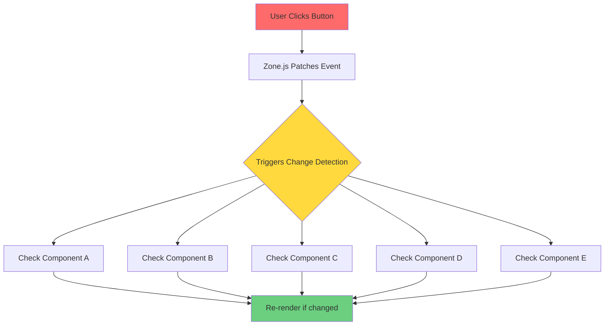
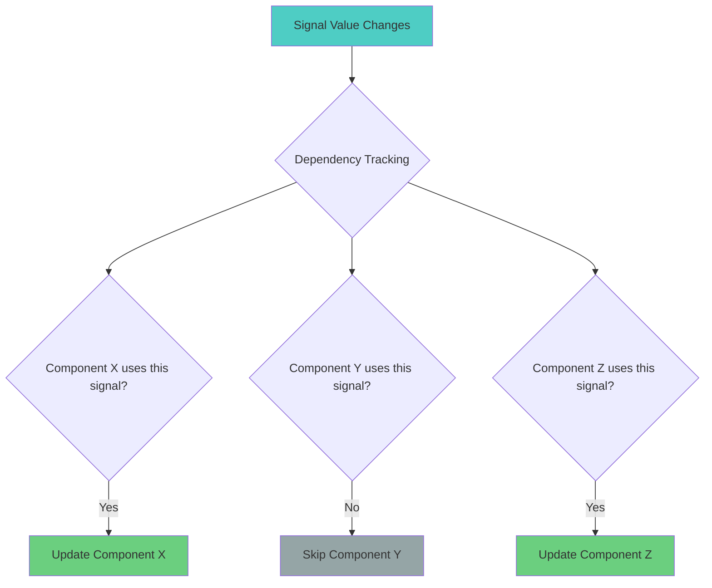
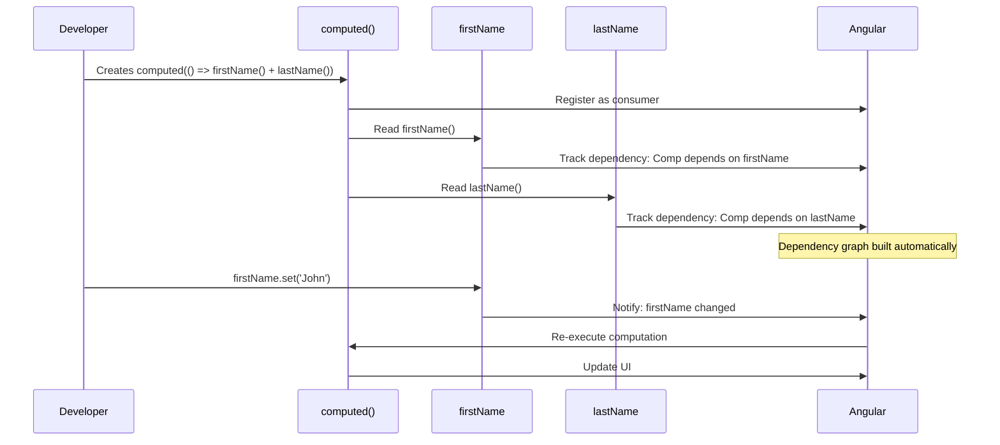
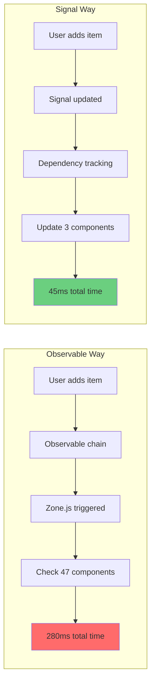
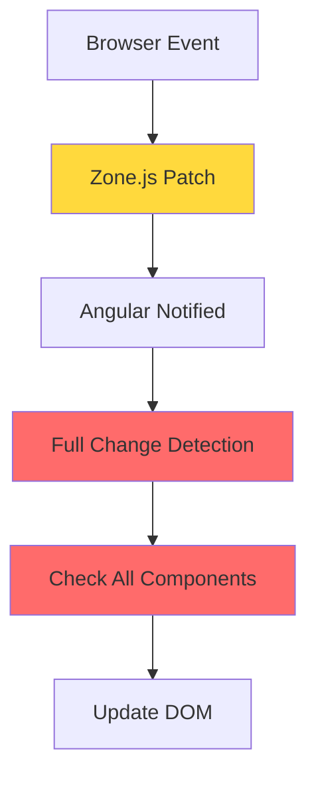
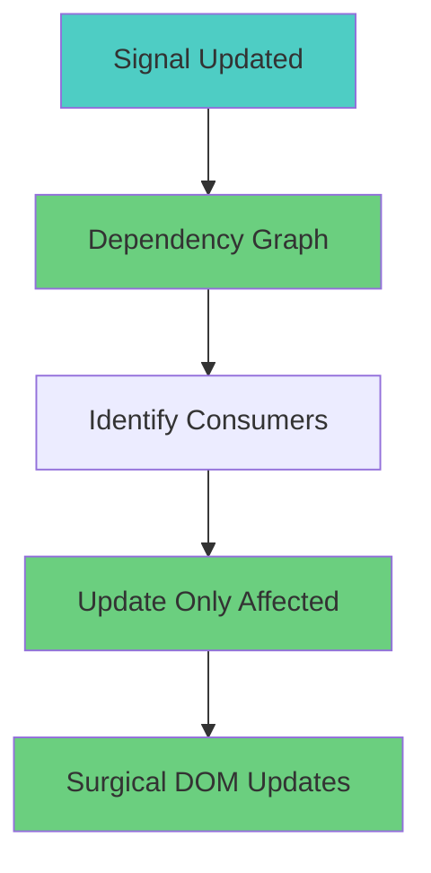
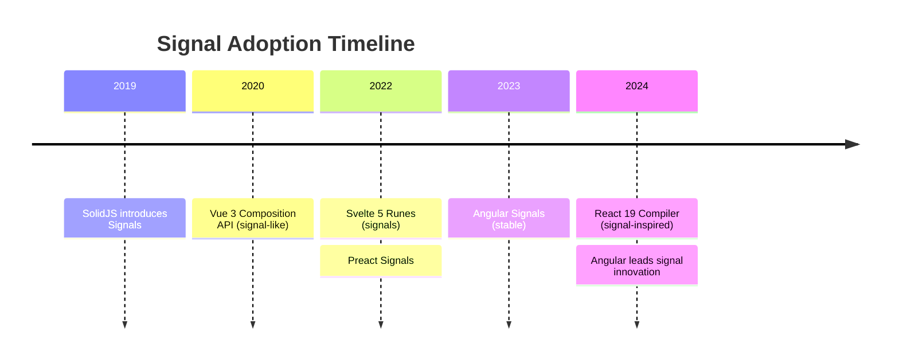
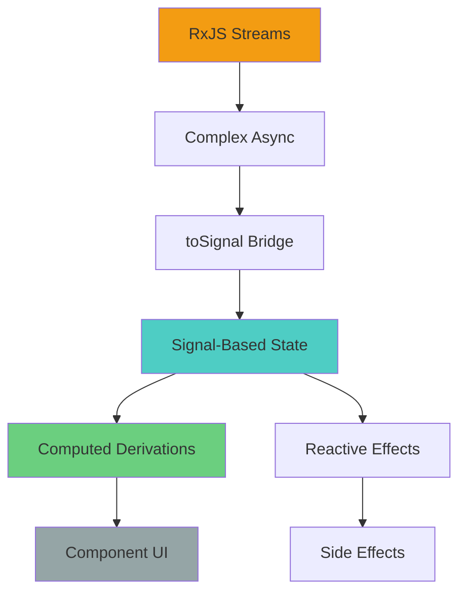

<!--
marp: true
theme: uncover
class:
- invert
- lead
-->

# "The Observable is dead! Long live the Signal!"

## A Story for Angular Developers

### Presentation by Muhammad Ahsan Ayaz Google Developer Expert in AI & Angular

;HS;

## 📈 Real-Time Data: The Ultimate Test

;VS;

### RxJS Stock Tracker (Complex Intervals)

;VS;

### Signals Stock Tracker (Clean & Simple)

;HS;

# The Observable is dead!

## Long live the Signal! 🔥

Muhammad Ahsan Ayaz

<!-- .element: class="fragment" -->

Google Developer Expert in AI & Angular

<!-- .element: class="fragment" -->

Author of "Mastering Angular Signals"

<!-- .element: class="fragment" -->

;HS;

## In the world of Angular...

We had applications built on the foundations of **RxJS Observables**

<!-- .element: class="fragment" -->

But **performance issues** were approaching the horizon...

<!-- .element: class="fragment" -->

_"This is a story of revolution, not evolution"_

<!-- .element: class="fragment" -->

;HS;

## The Status Quo: Angular with RxJS

;VS;

### What's Good About RxJS?

- **Mature & Battle-tested** (10+ years of RxJS)
  <!-- .element: class="fragment" -->
- **Powerful async handling** (HTTP, events, complex streams)
  <!-- .element: class="fragment" -->
- **Rich ecosystem** (operators, patterns, libraries)
  <!-- .element: class="fragment" -->
- **Handles complexity** (switchMap, combineLatest, etc.)
  <!-- .element: class="fragment" -->

_"RxJS has served us well... but cracks are showing"_

<!-- .element: class="fragment" -->

;HS;

## 🔍 The Hidden Problems

;VS;

### The Observable Way - Shopping Cart Example

Problems: Manual subscriptions, memory leaks, Zone.js overhead

<!-- .element: class="fragment" -->

;HS;

## ⚙️ The Mechanism Problem: Zone.js

;VS;

Zone.js checks **ENTIRE component tree** even if only one component needs updating!

<!-- .element: class="fragment" -->

;HS;

## 📊 The Performance Cost

;VS;

### Real Angular App Analysis

**Before Signals (Zone.js):**

- **47 components** checked per user interaction
- **280ms** average change detection time
- Memory leaks from forgotten unsubscriptions

**After Signals:**

- **3 components** updated per interaction
- **45ms** average update time
- **Zero** subscription management

**Result: 84% performance improvement!**

<!-- .element: class="fragment" -->

;HS;

## ✅ The Solution: Angular Signals

;VS;

### Fine-Grained Reactivity Mechanism

Only components that **actually use the signal** get updated!

<!-- .element: class="fragment" -->

;HS;

## ⚔️ Our Response: Three Paths Forward

;VS;

### 🛡️ DEFEND: Stick with RxJS Only

- Keep current patterns
  <!-- .element: class="fragment" -->
- Accept performance bottlenecks
  <!-- .element: class="fragment" -->
- Continue manual subscription management
  <!-- .element: class="fragment" -->
- _"The old ways are best"_
  <!-- .element: class="fragment" -->

;VS;

### 🏃 ESCAPE: Flee to Other Frameworks

- React, Vue, Svelte have signals
  <!-- .element: class="fragment" -->
- Abandon Angular ecosystem
  <!-- .element: class="fragment" -->
- Rewrite everything
  <!-- .element: class="fragment" -->
- _"The grass is greener..."_
  <!-- .element: class="fragment" -->

;VS;

### 💥 ATTACK: Embrace Angular Signals!

- Modern reactivity within Angular
  <!-- .element: class="fragment" -->
- Best of both worlds
  <!-- .element: class="fragment" -->
- Gradual migration path
  <!-- .element: class="fragment" -->
- _"Evolution within the ecosystem"_
  <!-- .element: class="fragment" -->

;HS;

## ✨ The Signal Revolution

;VS;

### The Signal Way - Same Shopping Cart

Benefits: Auto-cleanup, targeted updates, readable code

<!-- .element: class="fragment" -->

;HS;

## 🔬 Deep Dive: Dependency Tracking

;VS;

### How Signals Track Dependencies

;HS;

## 🛠️ Your Signal Arsenal

;VS;

### `signal()` - The Foundation

;VS;

### `computed()` - Derived Power

;VS;

### `effect()` - Side Effect Magic

;HS;

## 🚀 Advanced Signal Patterns

;VS;

### `linkedSignal()` - Smart Dependencies

;VS;

### `resource()` - Async Made Easy

;VS;

### Component APIs - Modern Integration

;HS;

## ⚡ Performance Comparison: Real App

;VS;

### Shopping Cart: Before vs After

Result: **84% faster, 94% fewer components checked**

<!-- .element: class="fragment" -->

;HS;

## 🗺️ The Migration Strategy

;VS;

### Phase 1: Interoperability

;VS;

### Phase 2: Signal-First Development

;VS;

### Phase 3: Full Signal Architecture

;HS;

## 🎬 Live Demo: The Difference

;VS;

### Observable-Based Counter (Old Way)

;VS;

### Signal-Based Counter (New Way)

Signal version: **67% less code, zero memory leaks, better performance**

<!-- .element: class="fragment" -->

;HS;

## 👻 The Zoneless Future

;VS;

### Current: Zone.js Dependency

Global, inefficient change detection

<!-- .element: class="fragment" -->

;VS;

### Future: Signal-Driven Applications

Precise, efficient reactivity

<!-- .element: class="fragment" -->

_"Signals are the foundation for Angular's performance future"_

<!-- .element: class="fragment" -->

;HS;

## 📈 Industry Validation

;VS;

### The Signal Revolution Across Frameworks

Angular isn't following trends - **we're setting them!**

<!-- .element: class="fragment" -->

;VS;

### Community Adoption Evidence

- **NgRx Signal Store**: Official signal-based state management
  <!-- .element: class="fragment" -->
- **Angular Material**: Migrating to signal APIs
  <!-- .element: class="fragment" -->
- **TanStack Angular Query**: Signal-first data fetching
  <!-- .element: class="fragment" -->
- **Community libraries**: 80% planning signal integration
  <!-- .element: class="fragment" -->
- **Developer satisfaction**: 92% positive feedback on signals
  <!-- .element: class="fragment" -->

;HS;

## 🤔 Common Concerns Addressed

;VS;

### "RxJS is still needed!"

✅ **Absolutely true!** RxJS excels at complex async flows

;VS;

### "Learning curve too steep?"

✅ **Signals are simpler than RxJS**

RxJS operators to learn: **125+**
Signal APIs to learn: **8 core functions**

;VS;

### "What about breaking changes?"

✅ **Perfect migration story**

- **Gradual adoption** - use `toSignal()` and `toObservable()`
- **RxJS isn't disappearing** - it's complementary
- **New APIs are additive** - old code keeps working
- **Long-term support** - Angular 18+ will support both paradigms

;HS;

## 🏆 Real-World Success Story

;VS;

### E-commerce Platform Migration

**Before Signals:**

- 2.3s page load time
- 47 subscriptions per page
- Memory leaks in checkout flow
- Complex state synchronization

**After Signals:**

- 0.8s page load time (65% improvement)
- Zero subscription management
- Eliminated memory leaks
- Crystal-clear state flow

Developer feedback: _"Signals made our codebase readable again"_

<!-- .element: class="fragment" -->

;HS;

## 🏛️ Victory: Modern Angular Architecture

;VS;

### The New Angular City:

**Best of both worlds:** Signals for state, RxJS for complex async

<!-- .element: class="fragment" -->

;HS;

## 🚀 Your Signal Journey

;VS;

### Start Today:

1.  **Experiment** with basic signals in a small component
    <!-- .element: class="fragment" -->
2.  **Convert** one Observable to a Signal using `toSignal()`
    <!-- .element: class="fragment" -->
3.  **Try** computed signals for derived state
    <!-- .element: class="fragment" -->
4.  **Build** a new feature with `resource()` for async data
    <!-- .element: class="fragment" -->
5.  **Master** the complete ecosystem
    <!-- .element: class="fragment" -->

;VS;

### Learning Resources:

- **Official docs**: angular.dev/guide/signals
  <!-- .element: class="fragment" -->
- **Interactive tutorial**: signals.angular.dev
  <!-- .element: class="fragment" -->
- **Code examples**: GitHub - angular/angular/tree/main/packages/core/signals
  <!-- .element: class="fragment" -->
- **Community**: Angular Discord #signals channel
  <!-- .element: class="fragment" -->

;HS;

## 📚 Master Angular Signals

"Mastering Angular Signals: A Practical Guide to Modern Reactivity, Performance, and Migration"

;VS;

### What You'll Master:

✅ **Core APIs**: `signal()`, `computed()`, `effect()`, `linkedSignal()`
✅ **Async Patterns**: `resource()`, `rxResource()`, error handling
✅ **Component Integration**: `input()`, `output()`, `model()`, `viewChild()`
✅ **Migration Strategies**: `toSignal()`, `toObservable()`, gradual adoption
✅ **Performance Optimization**: dependency tracking, memoization
✅ **Testing**: Unit testing signal-based components and services
✅ **Real-World Examples**: Shopping cart, dashboard, forms, notifications
✅ **Future-Proofing**: Zoneless Angular, signal stores, architectural patterns

;VS;

### Available Now:

- 📖 **Amazon** (paperback & digital)
- 💻 **GitHub** with full source code
- ✨ 25+ practical examples
- 🚀 Runnable code repository

github.com/AhsanAyaz/mastering-angular-signals-book

;HS;

## 📢 Join the Signal Revolution!

### The Observable Era is Ending

### The Signal Era Has Begun

;VS;

### Your Mission:

1.  **Try Signals** in your next feature today
    <!-- .element: class="fragment" -->
2.  **Benchmark** the performance difference
    <!-- .element: class="fragment" -->
3.  **Share** your success stories with the community
    <!-- .element: class="fragment" -->
4.  **Prepare** your codebase for the zoneless future
    <!-- .element: class="fragment" -->
5.  **Master** the paradigm that will define Angular's next decade
    <!-- .element: class="fragment" -->

;VS;

### Connect & Continue Learning:

- **Twitter**: @CodeWithAhsan
  <!-- .element: class="fragment" -->
- **YouTube**: Code with Ahsan (25K+ subscribers)
  <!-- .element: class="fragment" -->
- **Newsletter**: AHSYNC BYTES (weekly Angular insights)
  <!-- .element: class="fragment" -->
- **LinkedIn**: Muhammad Ahsan Ayaz
  <!-- .element: class="fragment" -->
- **Discord**: Angular Community #signals
  <!-- .element: class="fragment" -->

;HS;

# Thank You! 🙏

## "The Observable is dead! Long live the Signal!"

### Questions & Discussion

Let's build the future of Angular together 🚀
